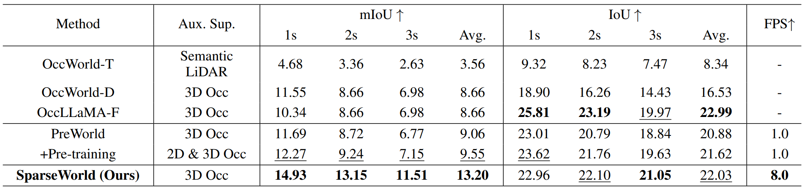
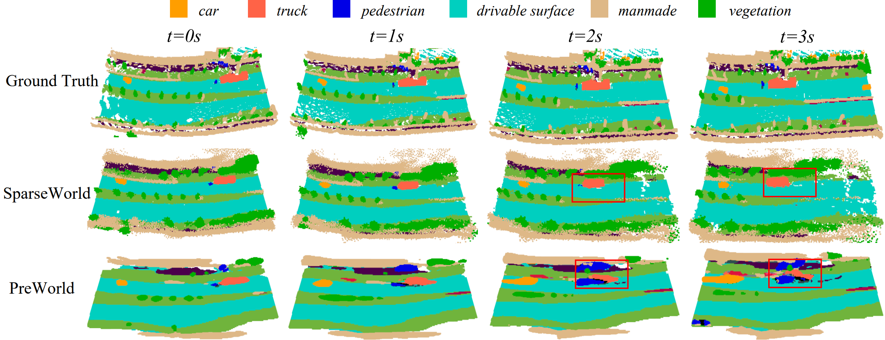

<div align="center">
<h3> [AAAI 2026] SparseWorld: A Flexible, Adaptive, and Efficient 4D Occupancy 

World Model Powered by Sparse and Dynamic Queries</h3>

<a href="https://arxiv.org/abs/2510.17482"></a>
[](https://huggingface.co/MSunDYY2001/SparseWorld/tree/main)


<div align="center">

[Chenxu Dang](https://msundyy.github.io)<sup>1,2\*</sup>, Haiyan Liu<sup>3</sup>, Jason Bao<sup>3</sup>, Pei An<sup>1</sup>, Xinyue Tang<sup>3</sup>, PanAn<sup>4</sup>, Jie Ma<sup>1†</sup>, \
Bingchuan Sun<sup>3†</sup>, Yan Wang<sup>2†</sup>  


<sup>1</sup>Huazhong University of Science and Technology  
<sup>2</sup>Institute for AI Industry Research (AIR), Tsing University <sup>3</sup>Lenove Group Limited\
<sup>4</sup>AIR Wuxi Innovation Center, Tsinghua University (AIRIC)

<div align="left">

## Abstract

Semantic occupancy has emerged as a powerful representation in world models for its ability to capture rich spatial
semantics. However, most existing occupancy world models rely on static and fixed embeddings or grids, which inherently limit the flexibility of perception. Moreover, their
“in-place classification” over grids exhibits a potential misalignment with the dynamic and continuous nature of real
scenarios. In this paper, we propose SparseWorld, a novel
4D occupancy world model that is flexible, adaptive, and efficient, powered by sparse and dynamic queries. We propose
a Range-Adaptive Perception module, in which learnable
queries are modulated by the ego vehicle states and enriched
with temporal-spatial associations to enable extended-range
perception. To effectively capture the dynamics of the scene,
we design a State-Conditioned Forecasting module, which
replaces classification-based forecasting with regressionguided formulation, precisely aligning the dynamic queries
with the continuity of the 4D environment. In addition, We
specifically devise a Temporal-Aware Self-Scheduling training strategy to enable smooth and efficient training. Extensive
experiments demonstrate that SparseWorld achieves state-ofthe-art performance across perception, forecasting, and planning tasks. Comprehensive visualizations and ablation studies further validate the advantages of SparseWorld in terms of
flexibility, adaptability, and efficiency.

<div align="left">

## Overview


</div>

<div align="left">

## News
- **`2026/1/13`**: We’ve released an upgraded version of SparseWorld, called SparseOccVLA ([code](https://github.com/MSunDYY/SparseOccVLA), [paper](https://arxiv.org/abs/2601.06474)), which successfully integrates sparse occupancy queries into LLMs. Feel free to check it out!
- **`2025/12/20`**: We release the inference and training code as well as the pretrained weight!
- **`2025/11/8`**: SparseWorld is accepted by AAAI 2026 🎉🎉!
- **`2025/10.10`**: The paper is released on [arXiv](https://arxiv.org/abs/2510.17482). 


## Getting Started
- [Installation](docs/install.md)

- [Prepare Dataset](docs/prepare_datasets.md)

- [Train and Eval](docs/getting_started.md)


## Model Zoo


|          Method           |                            Config                            | Avg mIoU | Avg IoU |  log  | Checkpoints |
| :-----------------------: | :----------------------------------------------------------: | :------: | :-----: | :---: | :---------: |
| SparseWorld-R50               | [config](configs/sparseworld/nuscenes-temporal/sparseworld-traj-finetune.py) | 13.20 | 22.03 | [log](https://huggingface.co/MSunDYY2001/SparseWorld/blob/main/20260113_074102.log) | [model](https://huggingface.co/MSunDYY2001/SparseWorld/tree/main/ckpts) |

Here, the model was trained on 8 H20 GPUs, while it only uses about 17 GB of GPU memory in practice, which means our results can be reproduced on consumer-grade GPUs such as the RTX 4090.
## Results and Visualizations

- Results
<div align="left">


- Comparative Visualizations




## Acknowledgement

Our code is developed based of following open source codebases:
- [OPUS](https://github.com/jbwang1997/OPUS)
- [PreWorld](https://github.com/getterupper/PreWorld)

We sincerely appreciate their outstanding works.

## Citation

If you find our work helpful or interesting, don’t forget to give us a ⭐. Thanks for your support!

If this work is helpful for your research, please consider citing:

```
@article{dang2025sparseworld,
  title={SparseWorld: A Flexible, Adaptive, and Efficient 4D Occupancy World Model Powered by Sparse and Dynamic Queries},
  author={Dang, Chenxu and Liu, Haiyan and Bao, Guangjun and An, Pei and Tang, Xinyue and Ma, Jie and Sun, Bingchuan and Wang, Yan},
  journal={arXiv preprint arXiv:2510.17482},
  year={2025}
}
```
```
@article{dang2026sparseoccvla,
  title={SparseOccVLA: Bridging Occupancy and Vision-Language Models via Sparse Queries for Unified 4D Scene Understanding and Planning}, 
  author={Dang, Chenxu and Wang, Jie and Guang, Li and Zihan, You and Hangjun, Ye and Jie, Ma and Long, Chen and Yan, Wang},
  journal={arXiv preprint arXiv:2601.06474},
  year={2026}
}
```
