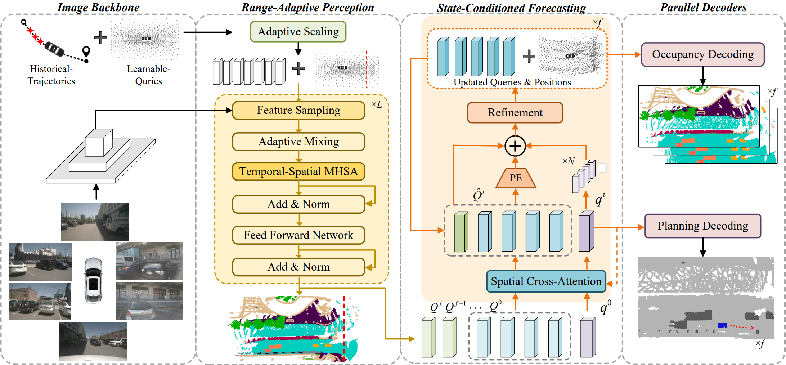

<div align="center">
<h3> SparseWorld: A Flexible, Adaptive, and Efficient 4D Occupancy World Model 
Powered by Sparse and Dynamic Queries</h3>

[arXiv](https://arxiv.org/abs/2510.17482)

<div align="left">

## Abstract

Semantic occupancy has emerged as a powerful representation in world models for its ability to capture rich spatial
semantics. However, most existing occupancy world models rely on static and fixed embeddings or grids, which inherently limit the flexibility of perception. Moreover, their
“in-place classification” over grids exhibits a potential misalignment with the dynamic and continuous nature of real
scenarios. In this paper, we propose SparseWorld, a novel
4D occupancy world model that is flexible, adaptive, and efficient, powered by sparse and dynamic queries. We propose
a Range-Adaptive Perception module, in which learnable
queries are modulated by the ego vehicle states and enriched
with temporal-spatial associations to enable extended-range
perception. To effectively capture the dynamics of the scene,
we design a State-Conditioned Forecasting module, which
replaces classification-based forecasting with regressionguided formulation, precisely aligning the dynamic queries
with the continuity of the 4D environment. In addition, We
specifically devise a Temporal-Aware Self-Scheduling training strategy to enable smooth and efficient training. Extensive
experiments demonstrate that SparseWorld achieves state-ofthe-art performance across perception, forecasting, and planning tasks. Comprehensive visualizations and ablation studies further validate the advantages of SparseWorld in terms of
flexibility, adaptability, and efficiency.

<div align="left">

## Overview



</div>

<div align="left">

## To Do
- [√] Release Paper
- [  ] Release Code

## Citation
If this work is helpful for your research, please consider citing:

```
@article{dang2025sparseworld,
  title={SparseWorld: A Flexible, Adaptive, and Efficient 4D Occupancy World Model Powered by Sparse and Dynamic Queries},
  author={Dang, Chenxu and Liu, Haiyan and Bao, Guangjun and An, Pei and Tang, Xinyue and Ma, Jie and Sun, Bingchuan and Wang, Yan},
  journal={arXiv preprint arXiv:2510.17482},
  year={2025}
}
```

## Acknowledge

Our code is developed based of following open source codebase:
- [OPUS](https://github.com/jbwang1997/OPUS)
- [PreWorld](https://github.com/getterupper/PreWorld)

We sincerely appreciate their outstanding works.